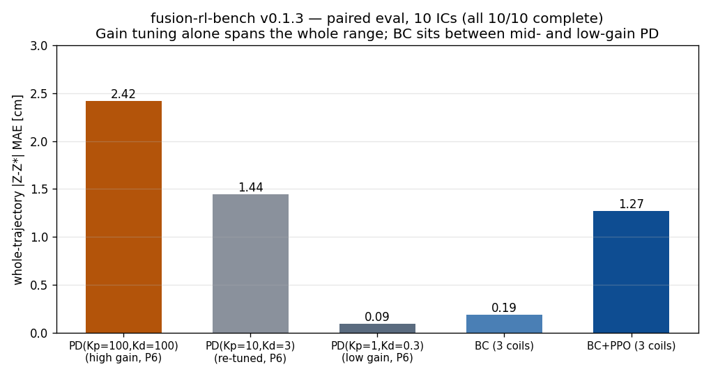

# fusion-rl-bench

**Reinforcement learning benchmarks for tokamak plasma control — with an honest evaluation protocol.**

一个面向托卡马克等离子体控制的强化学习实验库：真实物理模拟环境、经典控制器/模仿学习/RL 基线，以及**统一口径的配对评估流程**。（中文说明见下文）

[](LICENSE)

---

## Status (v0.1.1, 2026-09-26)

**What this is**: a working, reproducible experiment chain — Gymnasium environments on real physics backends, PD/BC/PPO baselines, and a unified paired evaluation harness (`scripts/fair_eval.py`).

**What we measured** (paired evaluation: 10 initial-condition seeds, same disturbance, same simulator instance, post-action sampling; errors per-episode then averaged; v0.1.3):

| Controller | Complete episodes | Whole-trajectory \|Z–Z*\| MAE |
|---|---|---|
| Classical PD (Kp=100, Kd=100, P6 only) | 10/10 | 2.42 cm |
| Classical PD (Kp=10, Kd=3, P6 only) | 10/10 | 1.44 cm |
| **Classical PD (Kp=1, Kd=0.3, P6 only)** | 10/10 | **0.09 cm** (0.08 cm on a second seed batch) |
| BC (imitating high-gain PD) | 10/10 | 0.19 cm |
| BC + PPO fine-tune (16,128 steps) | 10/10 | 1.27 cm |



**The honest headline**: learned controllers beat their high-gain teacher — *but simply lowering the PD gains achieves the lowest error of all*. Gain tuning alone spans the entire performance range; BC lands between mid- and low-gain PD. Trajectory comparison shows gain-saturated PD chatters (rail-to-rail actions injecting a limit cycle), while low-gain or smoothed control avoids it. The "BC learns smoothing from noisy expert data" reading is currently a **mechanism hypothesis**, not an established finding — it is the target of our stage-B ablation.

**What this does NOT establish**: single training seed, a **linearized MAST-U-like model** (not an exact MAST-U replica), 25 ms simulated episodes, **asymmetric actuator authority** (PD single-channel vs learned 3-channel), and no LQR/LQG comparison yet — LQR is natively smooth on a linear plant and is the real arbiter. The frozen PPO was initialized from an earlier BC version, so BC→PPO attribution must be reported separately.

> v0.1.2→v0.1.3 changelog: added pre-specified low-gain PD control (PD(1,0.3)); fixed invalid-reset samples leaking into summary metrics (evaluator now filters `sample_valid` in all summaries; training eval skips anomalous resets); mechanism framing downgraded to hypothesis.

## Environments

| Env | Physics | Task | Speed |
|---|---|---|---|
| `envs/freegsnke_linear_pos_env.py` (recommended) | FreeGSNKE linear evolution (`nl_solver`, `linear_only=True`) | vertical/radial position hold under random initial disturbances | ~50 ms/step |
| `envs/freegsnke_shape_env.py` | FreeGSNKE static Newton–Krylov solves | LCFS shape control (advanced) | slower; see notes |

Physical facts measured on this model (baseline equilibrium, 65×129 grid — model-specific, not device measurements):

- Vertical instability growth rate ≈ **233/s** (e-folding ≈ 4.3 ms) from the linearization diagnostics.
- Actuator authority scan (100 V, 5 ms pulse): coil **P6 ≈ 3.4 mm/kV** on vertical position vs 0.01–0.02 mm/kV for the other 11 active coils.
- Observation must include the **time derivative** of position error for a memoryless policy to imitate a PD law (position alone is not a learnable mapping).

## Repository layout

```
envs/           Gymnasium environments (FreeGSNKE-based)
scripts/        train_ppo.py / pd_baseline.py / bc_warmup.py / fair_eval.py / plot_curve.py
notebooks/      Engineering reports (Chinese): reproduction, profiling, post-mortems, evaluation fixes
assets/         Figures
results/        Paired evaluation raw per-episode data (JSON)
docs/           Setup guide and troubleshooting log (12+ real pitfalls)
```

## Quickstart

### 1. Install (tested on Python 3.13.5 / Windows; other versions untested)

```bash
python -m venv .venv && source .venv/Scripts/activate  # Windows Git Bash; Linux: source .venv/bin/activate
pip install gymnasium stable-baselines3 torch matplotlib shapely

# FreeGSNKE upstream (contains machine configs + example data)
git clone https://github.com/FusionComputingLab/freegsnke
pip install -e ./freegsnke
export FREEGSNKE_REPO=$PWD/freegsnke   # envs read this variable
```

> Historical note: FreeGSNKE previously pinned `numpy~=1.26` while TORAX needs `numpy>2` — use **separate virtual environments** for TORAX-based and FreeGSNKE-based work (see `docs/SETUP.md`). Current upstream constraint is `numpy>=1.26.4,<2.5`.

### 2. Smoke test

```bash
python envs/smoke_test_linear.py   # builds MAST-U-like machine, solves baseline equilibrium, steps actions
```

### 3. Reproduce the baselines

```bash
python scripts/pd_baseline.py                          # PD grid search (10 episodes per gain)
python scripts/bc_warmup.py                            # PD expert data + behavior cloning
BC_INIT=runs/bc_policy.pt python scripts/train_ppo.py  # PPO fine-tune (own run dir per launch)
python scripts/fair_eval.py --episodes 10 --seed0 3000 \
    --bc runs/bc_policy.pt --ppo <run_dir>/ppo_final.zip \
    --out results/fair_eval.json                       # unified paired evaluation
```

Frozen models and raw evaluation data are attached to [GitHub Releases](https://github.com/professorwang/fusion-rl-bench/releases) (bc_policy.pt, ppo_final.zip, fair_eval JSON) with SHA-256 hashes.

## Roadmap (verification before claims)

- [ ] Re-tuned PD + **LQR/LQG** classical baselines; single-P6 and three-coil comparisons reported separately
- [ ] ≥5 independent training seeds; frozen 100–200 test ICs; confidence intervals
- [ ] Robustness: observation noise, actuation latency, parameter error, sustained disturbances
- [ ] Re-check in a convergent nonlinear evolution model
- [ ] Real-device path (with university partners): model validation → sim closed-loop → shadow mode → approved experiment

## Citation

```bibtex
@software{fusion_rl_bench_2026,
  title  = {fusion-rl-bench: Reinforcement learning benchmarks for tokamak plasma control},
  author = {fusion-rl-bench contributors},
  year   = {2026},
  url    = {https://github.com/professorwang/fusion-rl-bench}
}
```

Also cite FreeGSNKE (Amorisco et al., *Physics of Plasmas* 31, 042517, 2024) and TORAX (Google DeepMind) when applicable.

## License

[Apache-2.0](LICENSE). © 2026 fusion-rl-bench contributors. FreeGSNKE/TORAX and other upstream dependencies retain their own licenses.

---

## 中文简介

本仓库提供基于真实物理后端（UKAEA FreeGSNKE 平衡求解器、DeepMind TORAX 输运模拟器）的托卡马克等离子体控制强化学习环境，以及经典 PD / 行为克隆 / PPO 微调的完整基线链与**统一口径的配对评估流程**。

**当前状态（v0.1.3）**：工程链路完整可复现。统一口径配对评估（10 个配对初始条件，全部完整）：PD(100/100) 2.42cm → PD(10/3) 1.44cm → **PD(1/0.3) 0.09cm**、BC 0.19cm、BC+PPO 1.27cm。诚实的结论是：**增益调参本身覆盖全部性能区间，学习类控制器超过高增益"老师傅"但低于简单调低增益的 PD**；轨迹对照显示高增益 PD 饱和振荡、低增益或平滑控制可消除——"BC 从带噪数据学到平滑化"目前仅为机制假说，是阶段 B 消融对象。另有单训练种子、线性化 MAST-U-like 模型、25 毫秒回合、执行器权限不对等、LQR 未对比等限制。此前基于口径不一致数据的"超越"表述已撤回（见 `notebooks/W06`）。

工程实录（复现报告、性能分析、三次翻车根因、评估方法返工）见 `notebooks/`；环境搭建与排坑记录见 `docs/SETUP.md`。

交流与合作：等离子体控制、聚变数字化方向，欢迎 issue 联系。
