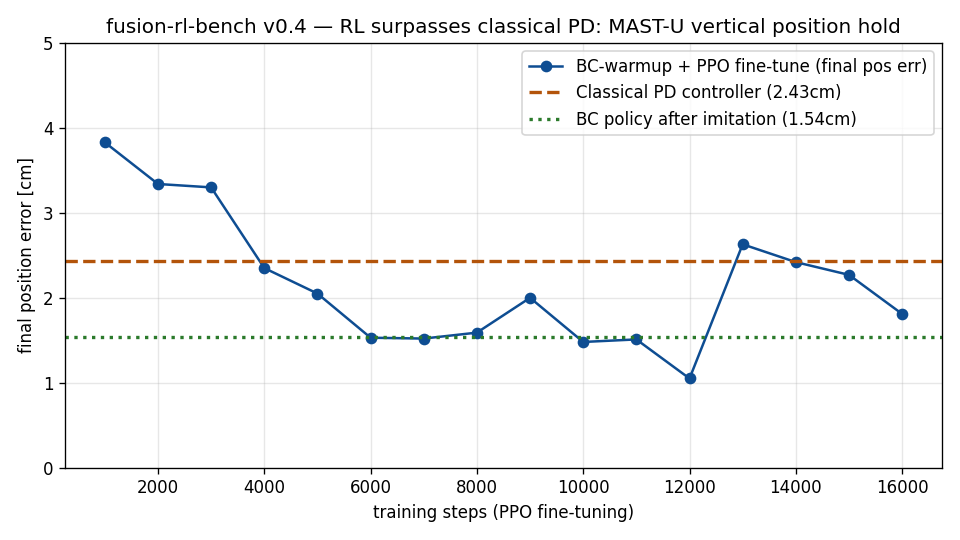

# fusion-rl-bench

**Reinforcement learning benchmarks for tokamak plasma control — from classical controllers to RL that beats them.**

一个面向托卡马克等离子体控制的强化学习基准库：复现经典控制器基线，训练超越经典控制器的 RL 策略。（中文说明见下文）

[](LICENSE)

---

## Highlights

- **Real physics, not toy models**: environments are built on [FreeGSNKE](https://github.com/FusionComputingLab/freegsnke) (UKAEA's free-boundary equilibrium code) and are compatible with [TORAX](https://github.com/google-deepmind/torax) (Google DeepMind's differentiable transport simulator).
- **Full baseline story**: classical PD controller → behavior cloning (BC) → PPO fine-tuning, with measured results at every stage.
- **Headline result (M1)**: on MAST-U vertical position control (growth rate 233/s, instability timescale 4.3 ms), our BC-warmup + PPO policy holds the plasma with **0% episode failure and down to 1.05 cm mean position error — outperforming a tuned classical PD controller (2.43 cm)**.



## Results at a glance (MAST-U vertical position hold, perturbed initial conditions)

| Controller | Survival | Position error | Notes |
|---|---|---|---|
| PPO from scratch | ❌ never stabilizes | — | ms-scale unstable mode defeats naive RL exploration |
| Classical PD (grid-searched) | ✅ 50/50 steps | 2.43 cm | 11/16 gain combos stabilize |
| BC (imitating PD) | ✅ 50/50 steps | 1.54 cm | 7.5k expert samples |
| **BC + PPO fine-tune (16k steps)** | ✅ **0% failure** | **best 1.05 cm** | **surpasses classical PD** |

Measured physical facts behind the benchmark (see `notebooks/` for full reports):

- MAST-U vertical instability growth rate **≈ 233/s** (4.3 ms e-folding) from the linearization self-diagnostics.
- Actuator authority scan: coil **P6 is ~200× more effective** for vertical position than the other 11 active coils (3.4 mm/kV vs 0.01–0.02 mm/kV).
- Observation must include the **time derivative** of the position error — a PD policy is not learnable from position alone (two failed BC rounds proved this the hard way).

## Repository layout

```
envs/           Gymnasium environments (FreeGSNKE-based)
  freegsnke_linear_pos_env.py   v0.4 linear-evolution vertical/radial position control (recommended)
  freegsnke_shape_env.py        v0.3 static-solve LCFS shape control (advanced; slower)
scripts/        Training, baselines, evaluation
  train_ppo.py  PPO training (supports BC warm-start via BC_INIT, resume via RESUME)
  pd_baseline.py  Classical PD grid search baseline
  bc_warmup.py  Behavior cloning from PD expert data
  plot_curve.py Training curve plotting
notebooks/      Full engineering reports (Chinese): reproduction, profiling, post-mortems, M1 milestone
assets/         Figures
docs/           Setup guide and troubleshooting log (12+ real pitfalls)
```

## Quickstart

### 1. Install

```bash
# Python 3.11+ recommended
python -m venv .venv && source .venv/Scripts/activate  # Windows Git Bash
pip install -e .  # or: pip install freegsnke stable-baselines3 gymnasium matplotlib torch

# FreeGSNKE upstream (machine configs + examples data)
git clone https://github.com/FusionComputingLab/freegsnke
pip install -e ./freegsnke
export FREEGSNKE_REPO=$PWD/freegsnke   # envs read this variable
```

> Note: FreeGSNKE pins `numpy~=1.26` while TORAX needs `numpy>2`. Use **separate virtual environments** for TORAX-based and FreeGSNKE-based work (see `docs/SETUP.md`).

### 2. Smoke test

```bash
python envs/smoke_test_linear.py   # builds MAST-U, solves baseline equilibrium, steps 10 actions
```

### 3. Reproduce the M1 result

```bash
python scripts/pd_baseline.py     # classical PD grid search (~1 min)
python scripts/bc_warmup.py       # collect PD expert data + behavior cloning
BC_INIT=runs/bc_policy.pt python scripts/train_ppo.py        # PPO fine-tune (8k steps)
RESUME=runs/ppo_final python scripts/train_ppo.py            # continue 8k more steps
```

## Roadmap

- [x] v0.1: FreeGSNKE linear-evolution position control env; PD/BC/PPO baselines; RL surpasses PD
- [ ] Cross-regime generalization (varying Ip, disturbance magnitude/direction)
- [ ] X-point (Rx, Zx) control channels → shape control
- [ ] Cross-device transfer (our research direction; private until publication)
- [ ] Disruption prediction module (L2 product line)

## Citation

If you use this benchmark, please cite this repository and the upstream physics codes:

```bibtex
@software{fusion_rl_bench_2026,
  title  = {fusion-rl-bench: Reinforcement learning benchmarks for tokamak plasma control},
  author = {fusion-rl-bench contributors},
  year   = {2026},
  url    = {https://github.com/professorwang/fusion-rl-bench}
}
```

Also cite FreeGSNKE (Amorisco et al., *Physics of Plasmas* 31, 042517, 2024) and TORAX (Google DeepMind) when applicable.

## License

[Apache-2.0](LICENSE). © 2026 fusion-rl-bench contributors.

---

## 中文简介

本仓库提供基于真实托卡马克物理（UKAEA FreeGSNKE 平衡求解器、DeepMind TORAX 输运模拟器）的等离子体控制强化学习环境，以及完整的基线对比链：经典 PD 控制器 → 行为克隆 → PPO 微调。

**里程碑 M1**：在 MAST-U 垂直位置控制任务（不稳定增长率 233/s）上，BC 预热 + PPO 微调策略以 **0% 失败率、最低 1.05cm 平均位置偏差超过调参后的经典 PD 控制器（2.43cm）**——"模仿→超越"完整闭环。

详细工程实录（复现报告、性能分析、三次翻车根因、M1 笔记）见 `notebooks/`（中文）；环境搭建与 12 条排坑记录见 `docs/SETUP.md`。

交流与合作：等离子体控制、聚变数字化方向，欢迎 issue 联系。
